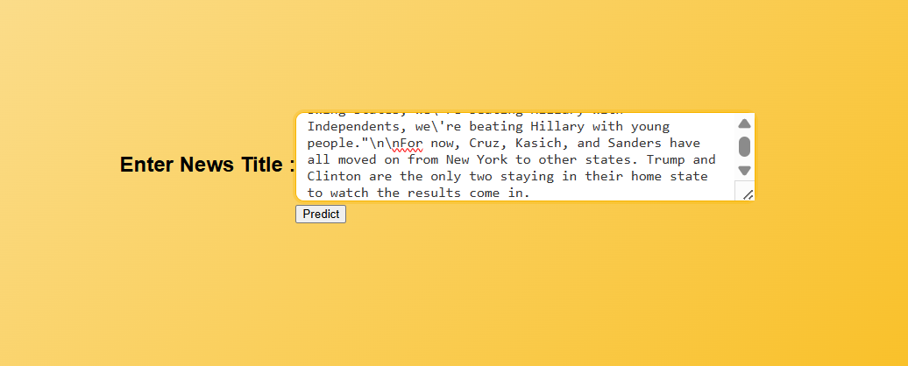

---

# 📰 Fake News Detection Web App

This is a simple Flask-based web application that predicts whether a given news headline is **Fake** or **Real** using a machine learning model trained on a dataset of news articles.

---

## ✅ Features

* Predicts fake or real news headlines
* Simple and responsive web interface
* Built using Flask and an LSTM-based ML model
* Uses NLTK for basic text preprocessing

---

## 📸 How It Works

1. Enter a news headline in the input box
2. Click the “Predict” button
3. The app tells you whether the headline is **Fake** or **Real**

---
## 📸 Screenshots

### 📝 Input Interface

### ✅ Prediction Output

---

## 🧰 Tech Stack

* **Backend**: Python, Flask
* **Frontend**: HTML, CSS
* **ML Model**: LSTM (Long Short-Term Memory)
* **NLP Tools**: NLTK for preprocessing

---

## 📂 Project Structure

* `app.py` – Main Flask application
* `templates/` – HTML files
* `static/` – CSS styling
* `model/` – Trained ML model file
* `images/` – Screenshots or icons
* `requirements.txt` – Python dependencies

---
